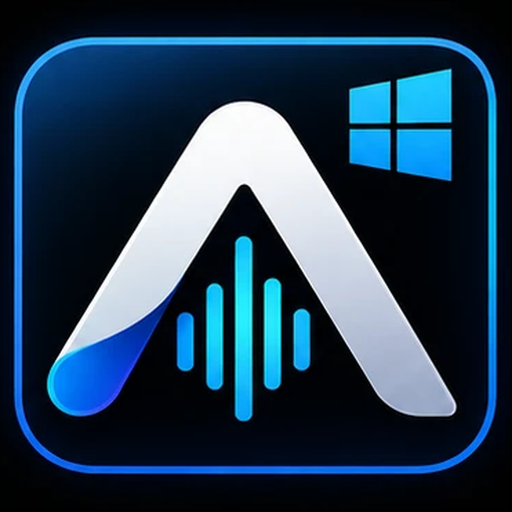
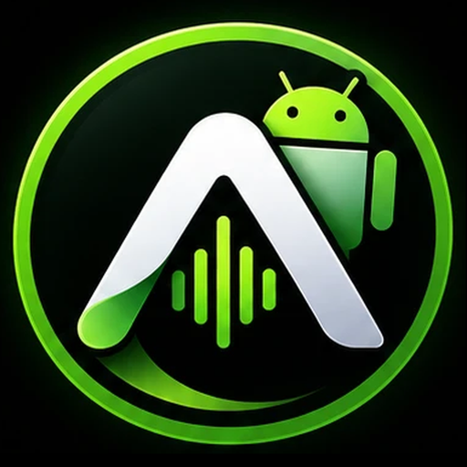
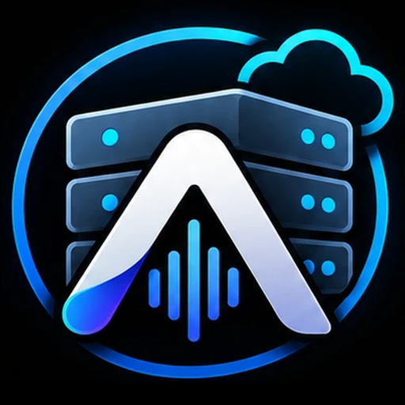
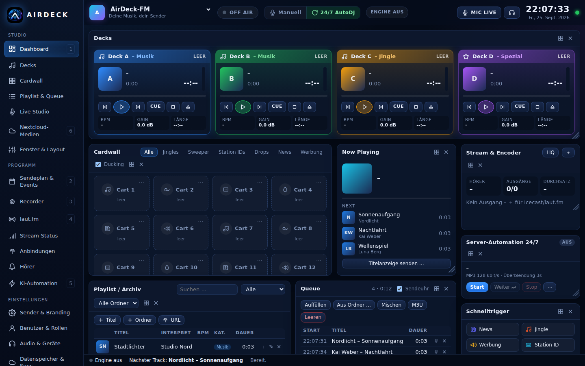
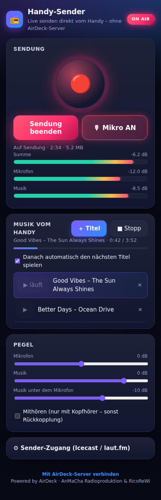
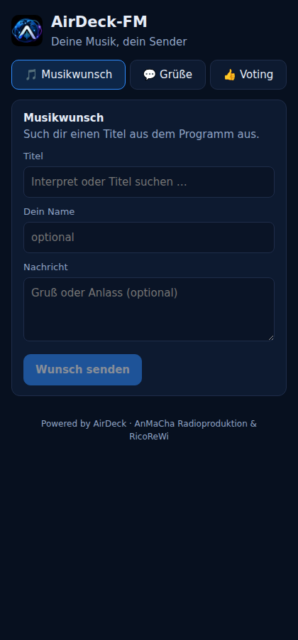

# AirDeck – Radio-Automation & Live-Broadcast

<p>
  
  
  
  
</p>

[](https://github.com/ricorewioriginal-collab/anmacha_control/actions/workflows/build.yml)


**Ein Projekt von RicoReWi / RicoReWi Music & Media – für Broadcast, Automation, Live und laut.fm.**

AirDeck ist eine eigenständige Sendesoftware für Webradio. Sie bietet Automation rund um die Uhr, Live-Sendungen mit Quellen-Priorität, Sendeplan, Playlist- und Medienverwaltung, Recorder, laut.fm-Verwaltung, Klangoptimierung und auf Wunsch einen komplett KI-moderierten Sender. AirDeck läuft als **Windows-Programm**, als **Server/Docker** oder gesteuert per **Android-App**. Einen eigenen Server brauchst du nicht.

## 🚦 Status: was läuft, was noch nicht

Diese Tabelle wird laufend nach echten Tests aktualisiert (kein Feature gilt als „fertig“, ohne real getestet zu sein). Ausführlicher Verlauf: [AIRDECK_PROGRESS.md](AIRDECK_PROGRESS.md).

| Bereich | Status | Kurz |
|---|---|---|
| **Kernbetrieb** (Server-Automation 24/7, Source-Priority, Crossfade, Ausgänge, REST-API) | ✅ läuft | Grundfunktionen aus früheren Phasen, mit echtem ffmpeg/Icecast getestet |
| **Oberfläche & Workflow** (Dashboard, Medienverwaltung, Nextcloud-Anbindung, Playlistverwaltung, Live Studio, In-App-Handbuch) | ✅ läuft | Gerade grundlegend überarbeitet: eigene Arbeitsbereiche statt Einzelfunktionen, mit Playwright gegen echte Server getestet |
| **Crossfade-Audioqualität** | 🟡 teilweise geprüft | Übergänge Musik↔Musik/Jingle per echtem Audio-Dekodier-Test bestätigt; Voice→Musik, Stream→Musik, Live→Automation noch nicht einzeln getestet |
| **Playlist-Shuffle** | ✅ läuft | Eigener Shuffle-Modus je Playlist (Interpreten-Trennung, „Jetzt neu mischen“); eine übergreifende Rotations-Engine für Sendeuhr/Queue ist ein späterer Schritt |
| **Medien-Integrität** | ✅ läuft | Fehlende Dateien, Duplikate, Relink für die gesamte Bibliothek (nicht nur eingebundene Ordner) |
| **Backup/Restore** | ✅ läuft | Echter Ende-zu-Ende-Test: Sichern → Daten löschen → Wiederherstellen → Zustand vergleichen |
| **Intelligente Rotation, Clock-Templates, Preflight, Hard/Soft-Timing** | ✅ läuft | Interpreten-/Genre-Trennung in der Rotation, Sendeuhr-Vorlagen, Preflight-Prüfung (fehlende Dateien/leere Pools/Rotationskonflikte) vor dem Senden, feste Zeitmarken im Sendeplan |
| **AirDeckCast** (eigene Streaming-/Verteilschicht, HLS, alternative Profile, Teststream, Failover) | ✅ läuft | Ein Programmbus speist mehrere Encoder-Ausgänge gleichzeitig (Zusatzprofile, HLS direkt vom Server, Teststream mit echtem Datenzuwachs-Nachweis, Ersatzziel springt automatisch bei Ausgangs-Ausfall ein und tritt bei Erholung zurück) |
| **Geräte-Pairing, LAN-Discovery, Connect-Schicht** | 🟡 teilweise | LAN-Discovery serverseitig vorhanden und seit Kurzem auch aus dem Studio erreichbar; QR/Kurzcode-Pairing und Geräteverwaltung offen |
| **Erweiterungen/Marktplatz, Team-Chat, Bug-Report-Backend, Statistik, Audit** | ⬜ offen | Noch nicht begonnen |
| **Long-Run-/Release-Härtung** (Watchdog, Crash Recovery, 24h/48h-Test, RC1) | ⬜ offen | Noch nicht begonnen |

**Legende:** ✅ läuft (real getestet) · 🟡 teilweise (Grundfunktion da, Lücken bekannt) · ⬜ offen (noch nicht umgesetzt). „Ein UI-Button gilt nicht als Funktion, ein grüner Build beweist nicht den Workflow“ – jeder Status hier stützt sich auf echte Tests, nicht auf bloßen Code.

## ⬇️ Download

| | Datei | Hinweis |
|---|---|---|
| 🪟 **Windows-Installer** | [**AirDeck-Setup.exe**](https://github.com/ricorewioriginal-collab/anmacha_control/releases/latest/download/AirDeck-Setup.exe) | Installation ohne Adminrechte. Deutsch/English, mit Audio-Engine (ffmpeg/LAME) und Android-APK |
| 🪟 **Windows portable** | [**AirDeck-Windows-Portable.zip**](https://github.com/ricorewioriginal-collab/anmacha_control/releases/latest/download/AirDeck-Windows-Portable.zip) | Ohne Installation: entpacken, `AirDeck.exe` starten |
| 🤖 **Android-App** | [**AirDeck-Android.apk**](https://github.com/ricorewioriginal-collab/anmacha_control/releases/latest/download/AirDeck-Android.apk) | Handy-Sender (ohne Server) oder Touch-Studio mit MIC LIVE und Mithören. Die APK gibt es auch direkt aus AirDeck unter `http://<PC>:8750/download/AirDeck-Android.apk` |
| 🐧 **Linux-Server** | [**AirDeck-Linux.deb**](https://github.com/ricorewioriginal-collab/anmacha_control/releases/latest/download/AirDeck-Linux.deb) | `sudo apt install ./AirDeck-Linux.deb` (Debian/Ubuntu, x86_64) – läuft als systemd-Dienst `airdeck-server` |
| 🐳 **Server (Docker)** | `docker compose up -d` | siehe [docs/DOCKER.md](docs/DOCKER.md) |

Alle Dateien stehen auf der Seite [**Releases → neuestes Release**](https://github.com/ricorewioriginal-collab/anmacha_control/releases/latest). Sie werden nach jeder Änderung automatisch gebaut und getestet. Solange das Repository privat ist, funktionieren die Links nur für angemeldete Mitglieder.
Windows kann bei nicht signierten Dateien warnen: „Weitere Informationen“ → „Trotzdem ausführen“ (Details in [docs/INSTALLATION.md](docs/INSTALLATION.md)).

## 🚀 Live-Demo ausprobieren

**[airdeck-demo.ricorewi-radio.de](https://airdeck-demo.ricorewi-radio.de)** – Studio direkt im Browser, ohne Installation.
Login: Benutzername `demo`, Passwort `airdeck-demo`

⚠️ Reine Testinstanz: setzt sich **automatisch alle 10 Minuten komplett zurück** (alle Daten weg), läuft ohne Audio-Engine – keine echte 24/7-Sendung möglich. Bitte nichts Echtes hier ablegen.

## 📸 Vorschau

Alle Screenshots zeigen den Sender **„AirDeck-FM“** mit Beispiel-Titeln – reine Testdaten, kein echter Sender.

| Studio (Windows/Browser) | Handy-Sender (Android) | Hörerbereich (Browser) |
|---|---|---|
| [](docs/screenshots/studio-desktop.png) | [](docs/screenshots/handy-sender.png) | [](docs/screenshots/hoerer-browser.png) |
| Decks, Cardwall, Queue, Stream/Encoder und Schnelltrigger auf einen Blick | Live senden vom Handy – Mikrofon, Musik und Pegel, ganz ohne AirDeck-Server | Musikwunsch, Grüße und Voting direkt aus dem Browser der Hörer |

## Funktionen

**Studio & Sendebetrieb**
- **Dashboard** als Sender-/Netzwerkübersicht (Karten je Sender: Logo, Status, aktueller Titel, Modus) – die eigentliche Arbeitsfläche (Decks, Cardwall, Queue, Live) liegt eine Ansicht weiter unter **Live Studio**, mit frei anordenbaren Fenstern (verschieben, Größe ändern, abdocken).
- **Medienverwaltung** als eigener Arbeitsbereich: Suche/Filter/Sortierung über die ganze Bibliothek, Mehrfach-Upload, Ordner-Import, Metadaten-Editor, Integritätsprüfung (fehlende Dateien, Duplikate, Relink), direktes Senden an Deck/Queue/Playlist/Cardwall. **Nextcloud** ist als Quellen-Reiter direkt eingebettet, nicht isoliert daneben.
- **Playlistverwaltung** als eigener Arbeitsbereich: anlegen/umbenennen/duplizieren, Titel hinzufügen/entfernen/verschieben, Modus **Manuell** oder **Shuffle** (Interpreten-Trennung, „Jetzt neu mischen“).
- Vier Decks mit CUE/Vorhören, Cardwall, Schnelltrigger, Queue mit Backtiming, Drag & Drop (auch Dateien direkt aus dem Explorer).
- **Server-Automation 24/7** ohne offenes Fenster: Crossfade, Carts mit Ducking, Mikrofon/Line-In, Stille-Erkennung, Notfall-Ordner, Autostart.
- **Source Priority Engine:** Live-Studio, Remote, Android, Automation und Relays mit Priorität, Übernahme, Fallback und Anti-Flapping.
- **Sendeplan & Events:** Programmpläne, Stundenuhr, Einzel-Jobs, Aufnahmepläne. Dazu ein **Recorder** mit Replays.
- **Klang:** Lautheitsangleich pro Titel (EBU R128), Klangprofile, 10-Band-EQ, Multiband, AGC und Limiter. **LAME-MP3** (CBR/VBR), AAC, Opus.
- **Ausgänge:** Icecast, SHOUTcast v1/v2, **laut.fm** (Zugang automatisch aus dem Radioadmin), optional über **Liquidsoap**.
- **Audio-Routing:** Sendesignal und Vorhören getrennt auf Windows-Ausgabegeräte legbar.

**laut.fm**
- Kompletter Radioadmin: Playlists, Titel, **Tags**, **Automations-Algorithmen** (16 Vorlagen), Sendeplan, Statistik, **Werbe-Trigger-Log**, Benutzer, Station, Live-Zugang.
- Anmeldung per Radioadmin-Token (callback/Origin wie von laut.fm vorgegeben). Dazu die öffentliche laut.fm-API vollständig nach Spezifikation.

**Status, Web & Anbindungen**
- **Stream-Status** für alle Sendewege, so wie Icecast ihn liefert: JSON, XML, M3U und XSPF. Für laut.fm-Sender baut AirDeck die Werte nach. Dazu kommen eine öffentliche Statusseite und ein einbettbares **Player-Widget**.
- **Brücke zu bestehenden Systemen:** AzuraCast, Icecast, SAM, mAirList, RadioDJ oder ein Web-Relay lassen sich als Relay-Quelle und Status-Spiegel einbinden. Die **Bridge-API** vergibt stabile Schlüssel, damit nichts doppelt angelegt wird ([docs/BRIDGE.md](docs/BRIDGE.md)).
- **Hörer-Interaktion:** Musikwunsch aus der Bibliothek, Grüße, Song-Voting mit Hörer-Charts und Sprachnachrichten ans Studio. Alles landet in einem Posteingang, die Hörerseite ist einbettbar und hat Schutz vor Missbrauch.
- **Nextcloud-Brücke:** Medien aus der Cloud übernehmen, Mitschnitte hochladen.
- REST-API mit Live-Ereignissen (SSE), signierte Webhooks, Telegram-Alarme, Now-Playing-Export.

**KI-Automation** ([docs/AI.md](docs/AI.md))
- Eigene API-Keys oder lokale Modelle. Text: OpenAI, Anthropic, Gemini, Ollama/LM Studio. Sprache: OpenAI TTS, ElevenLabs, Kokoro, Piper offline.
- Moderation alle n Titel, Nachrichten zur vollen Stunde aus eigenen Quellen und KI-Musikplanung. Freigabe-Modus, Kostenkontrolle mit Budgets und Protokoll.

**Betrieb & Sicherheit**
- **Benutzerverwaltung** mit Login und Logout sowie Rollen: Administrator, Sendeleitung, Redaktion, Moderation, Ansicht. Die Rollen lassen sich pro Sender zuweisen.
- Mehrere Sender mit eigenem Logo. Datenspeicher lokal oder mit Sync zu MySQL/MariaDB bzw. Firebase. Zugangsdaten liegen verschlüsselt (AES-256-GCM).
- **Windows-Programm** `AirDeck.exe` mit eigenem Fenster, Tray-Symbol und Audio-Engine im Hintergrund (Fenster zu, Sendung läuft weiter). **Updates** per Klick. Handbuch als echte Ansicht im Programm (gleiche Seitenleiste/Kopfzeile, mit Volltextsuche), nicht als externe Seite.
- **Android-App** mit eigenem **Handy-Sender**: Mikrofon und Musik vom Handy direkt zu laut.fm oder Icecast, ohne Server und auch bei ausgeschaltetem Bildschirm. Alternativ Fernbedienung für das Studio am PC.

## Schnellstart

**Windows:** Installer starten, fertig. Das Studio öffnet sich, AirDeck läuft danach im Hintergrund. Das Symbol im Infobereich bietet Studio öffnen, Protokoll und Beenden.

**Android:** Im Studio am PC unter **Android-App** „Im Netzwerk erreichbar“ einschalten. Dann die APK auf dem Handy laden und mit Adresse und Kopplungscode verbinden ([Anleitung](docs/INSTALLATION.md#android)).

**Server:**
```bash
docker compose up -d
docker compose logs airdeck      # Einmal-Passwort für „admin“ und Admin-Token
```
Ohne Docker geht es mit Node.js ≥ 22.18 und ffmpeg: `npm install && npm start`. Danach läuft das Studio unter `http://127.0.0.1:8750`.

| Variable | Standard | Bedeutung |
|---|---|---|
| `AIRDECK_PORT` | `8750` | HTTP-Port |
| `AIRDECK_HOST` | `127.0.0.1` | Bind-Adresse. `0.0.0.0` für Netz/Server, im Internet nur hinter HTTPS |
| `AIRDECK_DATA` | `./data` | Daten, Medien, Protokolle, verschlüsselte Zugangsdaten |
| `AIRDECK_SECRET_KEY` | *(auto)* | 64 Hex-Zeichen. Sonst wird `data/.secret.key` erzeugt |
| `AIRDECK_FFMPEG` | *(auto)* | Pfad zu ffmpeg |

## Dokumentation

| Thema | Datei |
|---|---|
| Handbuch (Inhalt; im Programm als eigene Ansicht eingebettet) | [studio/handbuch.html](studio/handbuch.html) |
| Installation Windows/Android | [docs/INSTALLATION.md](docs/INSTALLATION.md) |
| Docker/Server | [docs/DOCKER.md](docs/DOCKER.md) |
| Streaming, Klang, Liquidsoap | [docs/STREAMING.md](docs/STREAMING.md) |
| Brücke & Bridge-API | [docs/BRIDGE.md](docs/BRIDGE.md) |
| KI-Automation | [docs/AI.md](docs/AI.md) |
| Architektur | [docs/ARCHITECTURE.md](docs/ARCHITECTURE.md) |
| Funktionsabgleich | [docs/FEATURE_PARITY.md](docs/FEATURE_PARITY.md) |
| Fortschritt | [AIRDECK_PROGRESS.md](AIRDECK_PROGRESS.md) |

## Mitmachen

Webentwicklerinnen und Webentwickler dürfen eigene Features einbauen. Aufbau, Regeln und Andockpunkte stehen in [CONTRIBUTING.md](CONTRIBUTING.md).

```bash
npm run check        # Typprüfung (Server + Studio) und alle Tests (aktuell 149, davon 143 grün, 6 übersprungen ohne z. B. echte MySQL/ffmpeg-Umgebung)
```

## Haftungsausschluss

AirDeck ist ein **privates Hobbyprojekt** und wird ohne Gewähr bereitgestellt. Die Nutzung erfolgt auf eigene Verantwortung, siehe [HAFTUNGSAUSSCHLUSS.md](HAFTUNGSAUSSCHLUSS.md).
